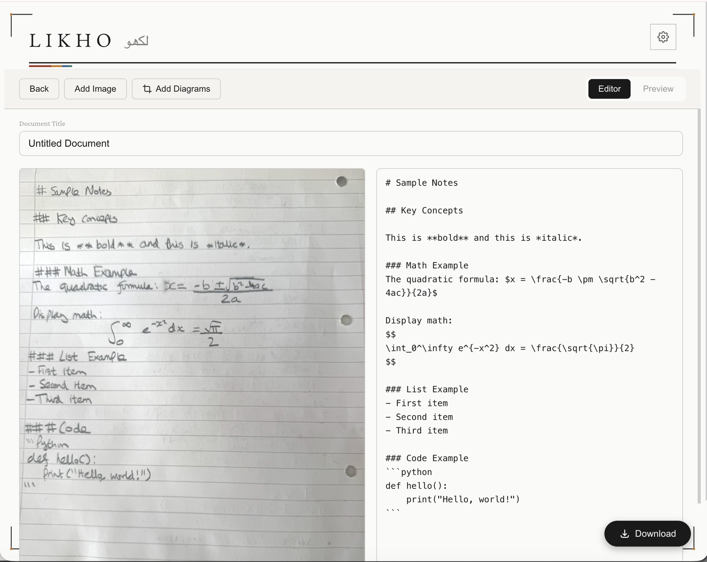

# Likho

**Turn photos of handwritten notes into clean, editable Markdown.**



*Likho (لِکھو) is Urdu for "write it."* Snap a picture of your notebook, drop it in, and Likho hands you back Markdown — equations, diagrams, and all — ready to paste into your tool of choice.

Built with Vue 3 + FastAPI, powered by [W&B Inference](https://docs.wandb.ai/guides/inference/) for vision OCR, with [Weave](https://weave-docs.wandb.ai/) ready to trace every call (toggle on from the gear icon when you want it) so you can see exactly what the model did.

## Features

- Drag and drop up to 5 images at once — they process in parallel
- Optional LaTeX equations and diagram descriptions
- **Per-image editor with sticky-thumbnail gutter** — each image owns its own section, edits stay scoped to the image you're working on
- **Embed diagrams from your source images** — open the crop modal, draw a rectangle on any page, get a `` reference inserted at your cursor. Per-reference resize via Obsidian-style `|W` / `|WxH` syntax, multi-page browsing in the modal, and the downloaded `.md` carries inline data-URL images so the file is self-contained
- Live Markdown editor with KaTeX math preview, click-to-zoom thumbnails, arrow-key navigation across sections
- **Compare any two of the available vision models on a single image** — pick the pair from a modal, see both OCR outputs side-by-side in a tripartite layout (image + two panes), click the image for a full-screen lightbox, then promote either model to active and continue editing — `/compare` route
- **Opt-in Weave tracing** — toggle from the gear icon. When on, every OCR / comparison / prompt-injection call is traced as a versioned `weave.Model` in your W&B project, and downloads can capture per-image rows to a Weave Dataset. When off (the default), Likho works as a pure local OCR tool with no W&B traffic beyond the inference call itself
- **Opt-in dataset capture on download** — when tracing is on, a small modal asks whether to also send the page rows to your Weave Dataset (`likho-ocr-captures`). Yes → per-image `(image, edited_markdown, original_ocr)` rows ship in the background, with all markdown image tags stripped from the text so the dataset stays clean for fine-tuning. No → local download only, zero network calls
- Pick your vision model from the gear icon — Kimi (default, fastest), Gemma, or Qwen
- First-run credentials modal — no manual `.env` editing required

## Prerequisites

- Python 3.11+ (we use [uv](https://docs.astral.sh/uv/) to manage it)
- Node.js 18+
- A W&B API key with Inference access — grab one at <https://wandb.ai/settings>

## Quick start

```bash
# Terminal 1 — backend
uv sync
uv run uvicorn backend.main:app --reload --port 8000

# Terminal 2 — frontend
cd frontend
npm install
npm run dev
```

Open <http://localhost:5173>. On first launch a modal asks for your W&B API key and (optionally) the entity + project if you want Weave tracing on right away. Paste in what you need, hit Save, and Likho writes everything to a local `.env` file (gitignored, created if missing). You're ready to drop in an image.

## Configuration

Likho reads everything from a single `.env` file at the repo root. The in-app credentials modal (gear icon, top right) reads from and writes to this file — no restart needed.

```env
WANDB_API_KEY=             # required — authenticates W&B Inference (+ Weave when tracing is on)
ENTITY=                    # required ONLY when WEAVE_TRACING_ENABLED=true
PROJECT=                   # required ONLY when WEAVE_TRACING_ENABLED=true
WEAVE_TRACING_ENABLED=     # optional, default false. Master toggle for traces + dataset capture.
MODEL=                     # optional — defaults to moonshotai/Kimi-K2.5
LIKHO_DATASET_NAME=        # optional — overrides the default likho-ocr-captures
```

The gear-icon modal has a single "Enable Weave tracing" checkbox. When off (default), the entity + project fields are hidden and no traces are sent to W&B regardless of what's in `.env`. When on, those fields appear, prefill from `.env`, and `weave.init` runs.

Prefer to set things up by hand? Copy `.env.example` to `.env` and fill it in.

## Vision models

Pick whichever fits your page. Switch any time from the gear icon.

| Model | Notes |
| --- | --- |
| `moonshotai/Kimi-K2.5` *(default)* | Fastest. Great on clean, well-lit pages. |
| `google/gemma-4-31B-it` | More careful on dense or messy handwriting; slower. |
| `Qwen/Qwen3.5-35B-A3B` | Strong on structured layouts (tables, multi-column). |

All three are served by W&B Inference — see the [model catalog](https://docs.wandb.ai/guides/inference/) for the latest list.

## How it works

Likho calls W&B Inference's [OpenAI-compatible API](https://docs.wandb.ai/guides/inference/api-reference/) using the `openai` Python SDK. Images are downscaled to ≤1600px before sending (the API rejects very large base64 payloads), and structured output is enforced via `response_format={"type":"json_schema", ...}` so the model returns clean Markdown instead of prose-with-code-fences. Every OCR call is wrapped with `@weave.op`, so you'll find a full trace at `https://wandb.ai/<entity>/<project>/weave` after each run.

## How Likho uses W&B

A single W&B API key powers four integrations. **W&B Inference always runs; the other three are gated by the tracing toggle.**

### 1. W&B Inference — the model serving the OCR (always on)

The vision LLM call goes to `https://api.inference.wandb.ai/v1` via the standard `openai` Python SDK with `base_url` overridden. No OpenAI account needed; the W&B key authenticates everything. Three vision models are exposed (Kimi-K2.5, Gemma 4 31B, Qwen 3.5 35B) and selected at runtime from the credentials modal.

→ Code: `backend/services/models.py` — `OCRModel(weave.Model)` builds an `AsyncOpenAI` client in its `PrivateAttr` and calls W&B Inference inside `@weave.op async def predict(...)`. The client construction and the OCR helpers live in `backend/services/inference_service.py` (`build_ocr_model`, `OCR_RESPONSE_FORMAT`, `maybe_downscale`, `clean_markdown`).
→ Docs: [W&B Inference](https://docs.wandb.ai/guides/inference/)

### 2. Weave tracing — observability for every model call (opt-in)

Tracing is **off by default**. Flip the "Enable Weave tracing" toggle in the gear-icon modal to turn it on; the modal then asks for entity + project. Under the hood:

- **On** → `weave.init(f"{entity}/{project}")` runs and `os.environ["WEAVE_DISABLED"]` is unset.
- **Off** → `os.environ["WEAVE_DISABLED"] = "true"` is set. Weave reads this env var on every op call, so `@weave.op` methods cleanly no-op — no exceptions, no measurable overhead. Toggling mid-session is a hard stop with no restart required.

When tracing is on, every model call lands as a structured trace at `https://wandb.ai/<entity>/<project>/weave`. Each call ties to a **versioned `weave.Model`** in the Models tab: changing `OCRModel.model_id` from Kimi to Gemma produces a new version automatically, and the trace UI shows the model's config (`model_id`, `max_image_dimension`, `max_output_tokens`) in the sidebar.

The trace tree for a `/process` request looks like:

```
GuardrailModel.predict       [only if customInstructions is non-empty]
OCRModel.predict             [the actual W&B Inference call]
```

For `/compare` (one image, two user-selected models in parallel):

```
GuardrailModel.predict       [only if customInstructions is non-empty]
ComparisonModel.predict      [parent op; postprocess strips to four user inputs]
├── OCRModel.predict         [child #1, e.g. Kimi]
└── OCRModel.predict         [child #2, e.g. Gemma; asyncio.gather under the hood]
```

The two routes don't have an outer wrapper op — they're plain FastAPI handlers that `Depends`-inject the Models and call `await model.predict(...)`. Both `OCRModel.predict` and `ComparisonModel.predict` record the same four inputs via `postprocess_inputs`: `image_base64`, `contains_latex`, `contains_diagrams`, `custom_instructions`. `GuardrailModel.predict` records only `custom_instructions`. Credentials, `self`, raw `UploadFile` blobs, and MIME types are all stripped.

`weave.attributes({...})` blocks (sidecar metadata for the filter panel) are currently commented out at every call site with a developer note. Wrap any future per-call metadata in `with weave.attributes({...}):` to bring them back.

→ Code:
- `backend/services/models.py` — all three `weave.Model` subclasses + their `postprocess_*` callbacks
- `backend/services/credentials.py` — `apply_tracing_setting()` reconciles the toggle with `WEAVE_DISABLED` and `weave.init`
- `backend/routers/ocr.py` — `Depends`-injected handlers calling `model.predict(...)`

→ Docs: [Weave](https://weave-docs.wandb.ai/), [`weave.Model`](https://weave-docs.wandb.ai/guides/core-types/models)

### 3. Weave Datasets — capture (image, edited-markdown) pairs on download (gated)

When tracing is on, **Download** opens a small modal asking whether to also send the rows to your Weave Dataset. Default is Yes. If you opt in, per-image rows POST to `/api/v1/dataset/capture`; the endpoint returns `202 Accepted` immediately and writes the rows to a Weave Dataset (`likho-ocr-captures` — override via `LIKHO_DATASET_NAME`) in a FastAPI `BackgroundTask`. The frontend doesn't `await` the POST — your `.md` file arrives the same instant either way.

When tracing is off, `/dataset/capture` returns `{accepted: 0}` immediately and nothing is written.

Before each row is sent, the client strips **all** markdown image tags (``) from the `markdown` field — both the `crop:` refs this app generates and any external images the user typed in. The dataset is meant to fine-tune a text OCR model, and image tags are noise at best in that context. The local `.md` you download is unaffected: it still inlines crops as data URLs so it's a self-contained, portable note.

Each captured row carries:

| Field | Purpose |
| --- | --- |
| `image_base64`, `image_filename` | the source image |
| `markdown` | the user's edited final text for that image |
| `original_ocr` | the model's pre-edit OCR (snapshotted at editor mount) — diff vs. `markdown` is the strongest "did the user need to fix this?" signal |
| `options` | LaTeX / diagram / custom-instructions flags at OCR time |
| `model_id` | which vision model produced the original OCR |
| `document_title`, `row_id`, `created_at` | metadata |

The dataset is versioned automatically — `add_rows` creates a new version on every download. Filter `image_sha256 == max(created_at)` at training time if you want latest-only.

→ Code: `backend/routers/dataset.py`, `frontend/src/services/api.js:captureDatasetRows`, `frontend/src/views/EditorView.vue:downloadMarkdown`

### 4. Weave Guardrails — prompt-injection protection

The `customInstructions` textarea is a free-form input that gets concatenated into the OCR prompt. It's a textbook prompt-injection vector. Likho wraps [LLM Guard](https://github.com/protectai/llm-guard)'s `PromptInjection` scanner (a fine-tuned DeBERTa classifier, runs locally, ~280MB model) as a `GuardrailModel(weave.Model)` subclass. The router calls `guardrail.predict(custom_instructions)` and reads the `{passed, risk_score}` dict directly.

What that means in practice:
- `GuardrailModel`'s public Pydantic attributes (`threshold`, `match_type`) are its version identity — tuning the threshold creates a new version automatically in the Weave Models tab.
- The model is `weave.publish`'d on first construction so the Models tab shows it even before the first call.
- Rejected requests **never reach the W&B Inference call** — the route raises HTTP 400 immediately. When tracing is on, the trace shows a `GuardrailModel.predict` call with `passed: false` and no downstream `OCRModel.predict`.
- The whole pre-flight runs locally (DeBERTa is a local model, no W&B network call), so it works the same way whether or not tracing is enabled — the only difference is whether the call appears in the Weave UI.

→ Code:
- `backend/services/models.py` — `GuardrailModel(weave.Model)` + `get_guardrail_model()` factory + `weave.publish` on first init
- `backend/routers/ocr.py` — `_enforce_guardrail()` runs `guardrail.predict(...)` and raises HTTP 400 on rejection

→ Docs: [Weave Guardrails & Monitors](https://weave-docs.wandb.ai/guides/evaluation/guardrails_and_monitors)

## Project layout

```
backend/
  main.py                 FastAPI app + apply_tracing_setting() on startup
  routers/
    ocr.py                POST /api/v1/ocr/process, POST /api/v1/ocr/compare
    config.py             GET/POST /api/v1/config — credentials + tracing toggle
    dataset.py            POST /api/v1/dataset/capture — Weave Dataset writes (gated)
  services/
    models.py             OCRModel / ComparisonModel / GuardrailModel — three
                          weave.Model subclasses; postprocess callbacks;
                          Depends factories (get_ocr_model_dep, get_guardrail_model)
    inference_service.py  Constants + helpers: AVAILABLE_MODELS, resolve_model,
                          OCR_RESPONSE_FORMAT, maybe_downscale, clean_markdown
    credentials.py        Reads/writes .env via python-dotenv; apply_tracing_setting()
                          reconciles the toggle with WEAVE_DISABLED and weave.init
  prompts/
    ocr_prompts.py        Prompt builder (LaTeX/diagram toggles)

frontend/src/
  views/
    UploadView.vue        Upload + options + Convert / Compare buttons
    EditorView.vue        Per-image editor sections, gutter thumbnails, Download
    CompareView.vue       Single-image comparison across two user-selected models —
                          picker modal, tripartite layout, image lightbox
  components/
    CredentialsModal.vue  Gear icon — W&B key, entity, project, active model
    DropZone.vue, ImagePreview.vue, OptionsForm.vue, ...
  stores/
    notes.js              images, results, options, customInstructions, etc.
    config.js             status (W&B credentials), available_models
    theme.js              dark/light toggle
  services/api.js         processSingleImage, processCompare,
                          captureDatasetRows, saveConfig, getConfigStatus
```

## Troubleshooting

- **`wandb_not_configured` when uploading** — open the gear icon and fill in your W&B API key. If the tracing toggle is on, entity + project are also required.
- **Empty or truncated output** — some pages confuse one model and not another. Switch models from the gear icon and retry.
- **"Image too large" errors** — Likho already downscales to 1600px before sending. If you're hitting this on a smaller image, file an issue with the original.
- **Weave traces not showing up** — first confirm the "Enable Weave tracing" toggle is on in the gear-icon modal. Then confirm `ENTITY` and `PROJECT` match a W&B project you have access to; the modal surfaces any init warnings.
- **Toggled tracing off but still seeing new traces?** Refresh the credentials modal and save again — `apply_tracing_setting()` sets `WEAVE_DISABLED=true` on save. Existing traces in the UI are historical and won't disappear; only new calls are silenced.

## Learn more

- [W&B Inference docs](https://docs.wandb.ai/guides/inference/)
- [W&B Inference API reference](https://docs.wandb.ai/guides/inference/api-reference/)
- [Weave (LLM observability)](https://weave-docs.wandb.ai/)
- [Weave Guardrails & Monitors](https://weave-docs.wandb.ai/guides/evaluation/guardrails_and_monitors)
- [LLM Guard (ProtectAI)](https://github.com/protectai/llm-guard)

## License

MIT — see `LICENSE` if added.
